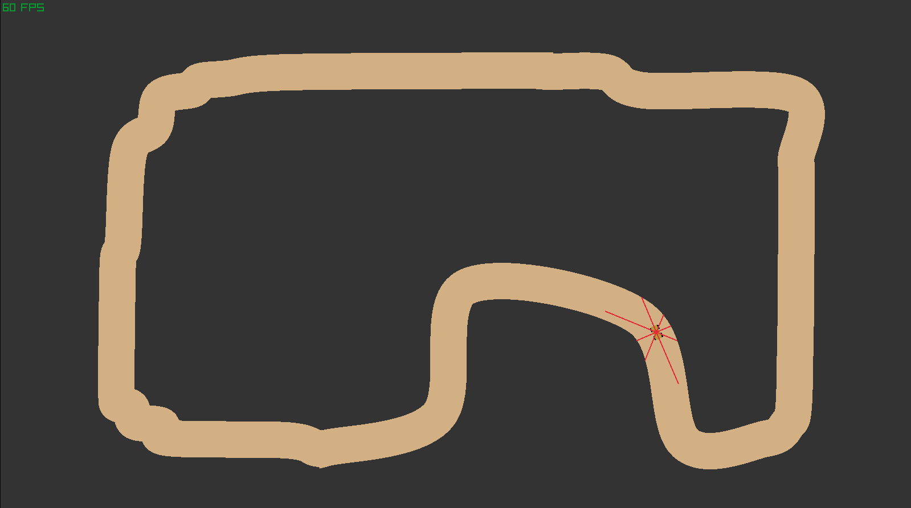

<p align="center">
  
</p>


# py-kart
Gen-AI algorithms comparison with self driving cars.


## Prerequisites
- Python version 3.12


## Installation

```bash
git clone https://github.com/Ojkee/py-kart.git
cd py-kart
pip install -r requirements.txt
python main.py
```


